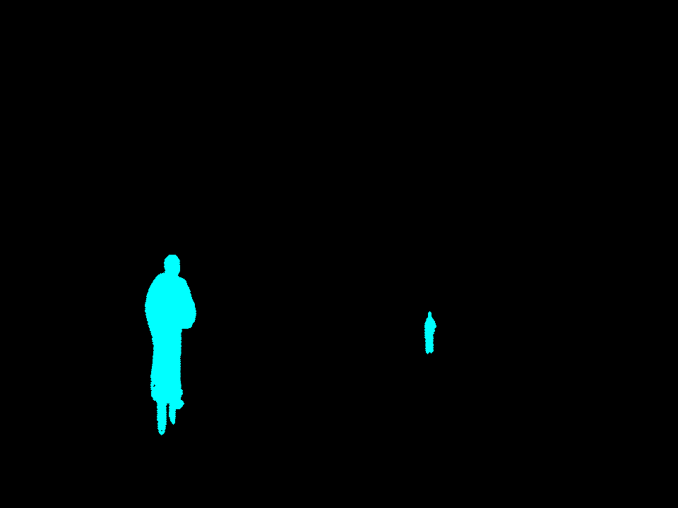

Readers and writers for image segmentation have the `-is` suffix.

Download the blue channel archive of the [camvid](https://datasets.cms.waikato.ac.nz/ufdl/camvid/) dataset
and extract it.

# Plugins

## Blue channel to Indexed PNG

The following command-line will convert it into a dataset using indexed PNG files:

```bash
idc-convert \
  -l INFO \
  from-blue-channel-is \
    -l INFO \
    -i "./bluechannel/*.png" \
    --labels Animal Archway Bicyclist Bridge Building Car CartLuggagePram Child Column_Pole \
             Fence LaneMkgsDriv LaneMkgsNonDriv Misc_Text MotorcycleScooter OtherMoving ParkingBlock \
             Pedestrian Road RoadShoulder Sidewalk SignSymbol Sky SUVPickupTruck TrafficCone \
             TrafficLight Train Tree Truck_Bus Tunnel VegetationMisc Void Wall \
  to-indexed-png-is \
    -l INFO \
    -p x11 \
    -o ./indexedpng
```

**NB:** Uses the [X11 color palette](https://en.wikipedia.org/wiki/X11_color_names) for the palette in the PNGs.

Here is an example (0001TP_007050.png):


## Blue channel to Indexed PNG (cyclists only)

By applying filters, you can also generate subsets, e.g., for building more specialized models.
The following will extract only images that have cyclists and discard all other annotations (`filter-labels`).
Images with no annotations left will get discarded (`discard-negatives`):

```bash
idc-convert \
  -l INFO \
  from-blue-channel-is \
    -l INFO \
    -i "./bluechannel/*.png" \
    --labels Animal Archway Bicyclist Bridge Building Car CartLuggagePram Child Column_Pole \
             Fence LaneMkgsDriv LaneMkgsNonDriv Misc_Text MotorcycleScooter OtherMoving ParkingBlock \
             Pedestrian Road RoadShoulder Sidewalk SignSymbol Sky SUVPickupTruck TrafficCone \
             TrafficLight Train Tree Truck_Bus Tunnel VegetationMisc Void Wall \
  filter-labels \
    -l INFO \
    --labels Bicyclist \
  discard-negatives \
    -l INFO \
  to-indexed-png-is \
    -l INFO \
    -p x11 \
    -o ./indexedpng-cyclists
```

Here is an example (0001TP_007380.png):


